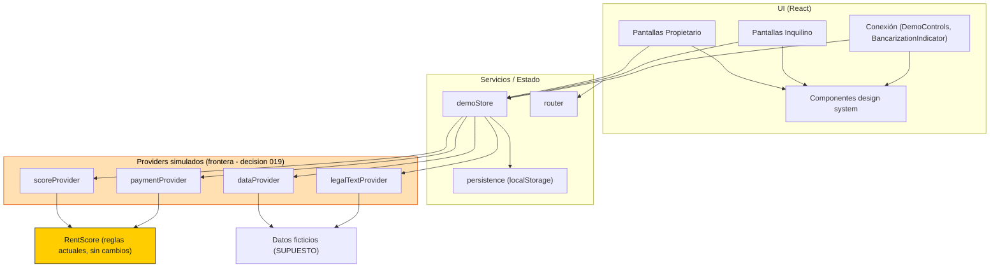
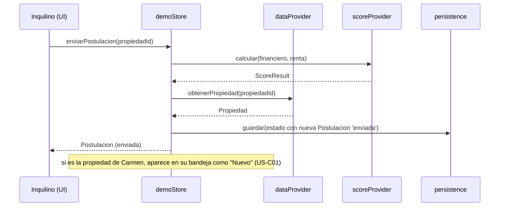

# Component Dependency — Application Design

## Diagrama de dependencias

Texto alternativo: Las pantallas (propietario, inquilino, conexión) y los componentes del design system consumen `demoStore` y el `router`. `demoStore` depende de `persistence` (localStorage) y de los cuatro providers simulados. `scoreProvider` y `paymentProvider` envuelven al motor `RentScore` actual (sin cambios). `dataProvider` y `legalTextProvider` sirven datos/textos ficticios. La UI nunca importa `RentScore` directamente: siempre pasa por un provider.

## Matriz de dependencias

| Componente | Depende de |
| --- | --- |
| Pantallas Propietario | demoStore, router, design system |
| Pantallas Inquilino | demoStore, router, design system |
| Conexión (demo/bancarización) | demoStore, router, design system |
| demoStore | persistence, scoreProvider, paymentProvider, legalTextProvider, dataProvider |
| scoreProvider | RentScore (actual) |
| paymentProvider | RentScore (actual) |
| dataProvider | datos ficticios |
| legalTextProvider | textos placeholder |
| persistence | Web Storage API (localStorage) |

## Reglas de acoplamiento
- **Regla de frontera (decisión 019)**: ningún componente de UI importa `RentScore`, datos ficticios ni lógica legal/pagos directamente; todo pasa por un provider. Esto permite sustituir cada provider por su versión real sin tocar la UI.
- **RentScore intacto**: `scoreProvider`/`paymentProvider` reutilizan las reglas actuales; se cubren con pruebas de caracterización (RNF-03).
- **Persistencia aislada**: solo `persistence` conoce `localStorage`.

## Data flow (postular → bandeja, US-I07 + US-C01)

Texto alternativo: al enviar una postulación, el store calcula el score vía `scoreProvider`, obtiene la propiedad vía `dataProvider`, persiste la nueva postulación en estado `enviada` y, si corresponde a la propiedad de Carmen, la agrega a su bandeja marcada "Nuevo".
