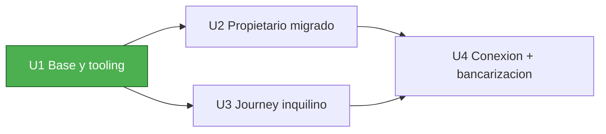

# Units of Work — Dependencias

## Matriz de dependencias

| Unidad | Depende de | Motivo |
| --- | --- | --- |
| U1 — Base y tooling | — | Fundación; no depende de otras unidades |
| U2 — Propietario migrado | U1 | Usa store, providers, tokens y componentes base de U1 |
| U3 — Journey del inquilino | U1 | Usa store, providers, tokens y componentes base de U1 |
| U4 — Conexión + bancarización | U2, U3 | Conecta la postulación del inquilino (U3) con la bandeja del propietario (U2) |

## Grafo

Texto alternativo: U1 es la base y habilita U2 y U3. U4 depende de U2 y U3 porque conecta ambos journeys.

## Estrategia de actualización
- **Enfoque**: Secuencial (Q2=A): U1 → U2 → U3 → U4.
- **Ruta crítica**: U1 (bloquea a U2 y U3); U4 requiere U2 y U3 terminadas.
- **Puntos de coordinación**: contrato de los providers y forma del `DemoState` (definidos en U1 y estables para U2..U4); esquema `inquilino`/`postulacion` (U3) consumido por U4.
- **Checkpoints** (Q4=A): aprobación al cierre de cada unidad.
  - Tras U1: pruebas de caracterización del RentScore en verde; app compila.
  - Tras U2: paridad del journey del propietario verificada.
  - Tras U3: flujo del inquilino funcional.
  - Tras U4: demo de punta a punta.
- **Rollback**: por control de versiones; artefacto estático, sin estado externo.
