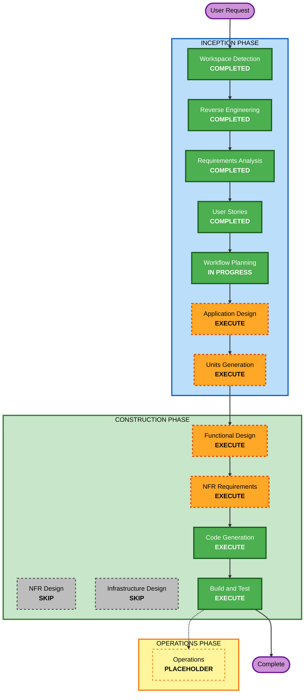

# Execution Plan — Ciclo AI-DLC LLAVE

## Detailed Analysis Summary

### Transformation Scope (Brownfield)
- **Transformation Type**: Architectural (migración de stack) + Application (nueva funcionalidad) + Technical-debt paydown.
- **Primary Changes**:
  - Migrar de HTML/JS/CSS vanilla sin build a un **stack con build** (Vite o Next.js export estático).
  - Refactor del render por strings a **componentes/plantillas**; introducir **TypeScript**; configurar **linting/formateo** y **pruebas**.
  - Implementar el **journey del inquilino** (US-I01..US-I10) y **conectar journeys** (US-C01, US-C02).
  - Formalizar **módulos simulados** tras interfaces (`scoreProvider`, `legalTextProvider`, `paymentProvider`).
- **Related Components**: `index.html`, `app.js`, `rentscore.js`, `styles.css`, `datos.js`, `design-system/tokens.json`, `vercel.json`, `docs/supuestos.md`.

### Change Impact Assessment
- **User-facing changes**: Sí — journey del inquilino nuevo; el del propietario se preserva con paridad.
- **Structural changes**: Sí — nuevo stack con build, organización modular, tipado, sistema de componentes.
- **Data model changes**: Sí (moderado) — nuevo modelo `inquilino` extensible + inventario de propiedades (8-10) + estados de postulación; se mantiene el contrato `financiero` del RentScore.
- **API changes**: N/A de red. Cambian contratos internos: interfaces de los módulos simulados y el modelo de datos.
- **NFR impact**: Sí — build/deploy, pruebas (caracterización RentScore), tipado, accesibilidad/responsive, seguridad de front (no como extensión bloqueante).

### Component Relationships (Brownfield)
- **Primary Component**: app/vista (hoy `app.js`) → se reescribe sobre el nuevo stack.
- **Shared Components**: `rentscore.js` (se envuelve en `scoreProvider`, sin tocar reglas), `datos.js` (se amplía a inquilino + propiedades), tokens del design system.
- **Supporting Components**: `vercel.json` (build + publish), `docs/supuestos.md` (mantener supuestos etiquetados).
- **Change types**: RentScore = Configuration/wrap (no reescribir); vista = Major; datos = Minor/Major (nuevas entidades); despliegue = Minor.

### Risk Assessment
- **Risk Level**: Medium. Migración de stack + funcionalidad nueva, pero sin backend, sin datos reales y con rollback trivial (git). El mayor riesgo es romper la **paridad** del journey del propietario al migrar.
- **Rollback Complexity**: Easy (control de versiones; artefacto estático).
- **Testing Complexity**: Moderate (caracterización del RentScore + pruebas de flujo/estado; sin integración externa).

## Workflow Visualization

Texto alternativo (por si el diagrama no renderiza):
- INCEPTION: Workspace Detection, Reverse Engineering, Requirements Analysis, User Stories = COMPLETADAS; Workflow Planning = EN CURSO; Application Design = EJECUTAR; Units Generation = EJECUTAR.
- CONSTRUCTION: Functional Design = EJECUTAR; NFR Requirements = EJECUTAR; NFR Design = OMITIR; Infrastructure Design = OMITIR; Code Generation = EJECUTAR; Build and Test = EJECUTAR.
- OPERATIONS: placeholder.

## Phases to Execute

### 🔵 INCEPTION PHASE
- [x] Workspace Detection (COMPLETED)
- [x] Reverse Engineering (COMPLETED)
- [x] Requirements Analysis (COMPLETED)
- [x] User Stories (COMPLETED)
- [x] Execution Plan (IN PROGRESS)
- [ ] Application Design — **EXECUTE**
  - **Rationale**: Hay nuevos componentes de UI (pantallas del inquilino, marketplace, ficha, lead form, consentimiento) y nuevas fronteras de servicio (módulos simulados). Conviene definir la arquitectura de componentes y las interfaces (`scoreProvider`, `legalTextProvider`, `paymentProvider`) y elegir el framework (Vite vs Next.js) antes de codificar.
- [ ] Units Generation — **EXECUTE**
  - **Rationale**: El trabajo se descompone naturalmente en varias unidades (base/tooling, journey propietario migrado, journey inquilino, conexión de journeys, módulos simulados). Ayuda a secuenciar y controlar la paridad.

### 🟢 CONSTRUCTION PHASE
- [ ] Functional Design — **EXECUTE**
  - **Rationale**: Nuevos modelos de datos (inquilino extensible, inventario de propiedades, estados de postulación) y lógica de negocio (dos capas de consentimiento, reglas de disponibilidad de modalidades, indicador de bancarización). Requiere diseño funcional por unidad.
- [ ] NFR Requirements — **EXECUTE**
  - **Rationale**: Selección de tech stack (Vite/Next.js + TypeScript + framework de test + linter) y NFR de build/deploy/pruebas/accesibilidad. Es donde se fija la pila concreta.
- [ ] NFR Design — **SKIP**
  - **Rationale**: Sin patrones NFR complejos (no hay performance/escalabilidad/seguridad de backend). Las decisiones NFR de un front estático se resuelven en NFR Requirements + Functional Design. Extensiones Seguridad/Resiliencia desactivadas.
- [ ] Infrastructure Design — **SKIP**
  - **Rationale**: No hay infraestructura que diseñar. El despliegue es estático en Vercel con build; se cubre como configuración en Code Generation / Build and Test.
- [ ] Code Generation — **EXECUTE (ALWAYS)** — por unidad.
- [ ] Build and Test — **EXECUTE (ALWAYS)** — build del stack + suite de pruebas (incluida caracterización del RentScore).

### 🟡 OPERATIONS PHASE
- [ ] Operations — PLACEHOLDER.

## Unit Update Strategy (propuesta preliminar para Units Generation)
- **Update Approach**: Secuencial con un punto de verificación de paridad.
- **Secuencia sugerida**:
  1. **U1 — Base y tooling**: nuevo stack con build, TypeScript, linter/formateo, estructura de carpetas, tokens del design system portados, `scoreProvider` envolviendo el RentScore + **pruebas de caracterización**.
  2. **U2 — Journey del propietario (migrado)**: reimplementar las 9 pantallas con paridad funcional sobre el nuevo stack.
  3. **U3 — Journey del inquilino**: marketplace, ficha, lead form, consentimiento en dos capas, ver RentScore, postular, seguimiento, retiro/revocación, aviso de deudor.
  4. **U4 — Conexión de journeys + bancarización**: postulación de Lucía en la bandeja de Carmen, indicador de bancarización, controles de demo.
- **Critical Path**: U1 bloquea a U2/U3; U3 alimenta U4.
- **Testing Checkpoints**: tras U1 (caracterización RentScore verde), tras U2 (paridad propietario), tras U3/U4 (flujo inquilino y conexión).
- La descomposición definitiva se confirma en **Units Generation**.

## Estimated Timeline
- **Total Phases a ejecutar**: 6 (Application Design, Units Generation, Functional Design, NFR Requirements, Code Generation, Build and Test).
- **Estimated Duration**: no aplica rígidamente (contexto de taller/demo); se avanza por unidad con aprobaciones.

## Success Criteria
- **Primary Goal**: prototipo saneado sobre stack con build, con el journey del inquilino completo y conectado al del propietario, y módulos sensibles simulados tras interfaces.
- **Key Deliverables**: nuevo proyecto con build; suite de pruebas (RentScore caracterizado); journeys funcionando con datos ficticios; despliegue estático en Vercel.
- **Quality Gates**: paridad del journey del propietario; pruebas verdes; lint/tipado sin errores; cero datos reales con SUPUESTO etiquetado.
- **Integration Testing**: ambos journeys funcionando juntos (postulación → bandeja).
