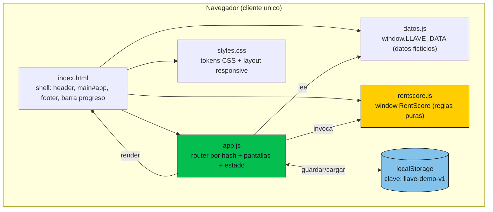
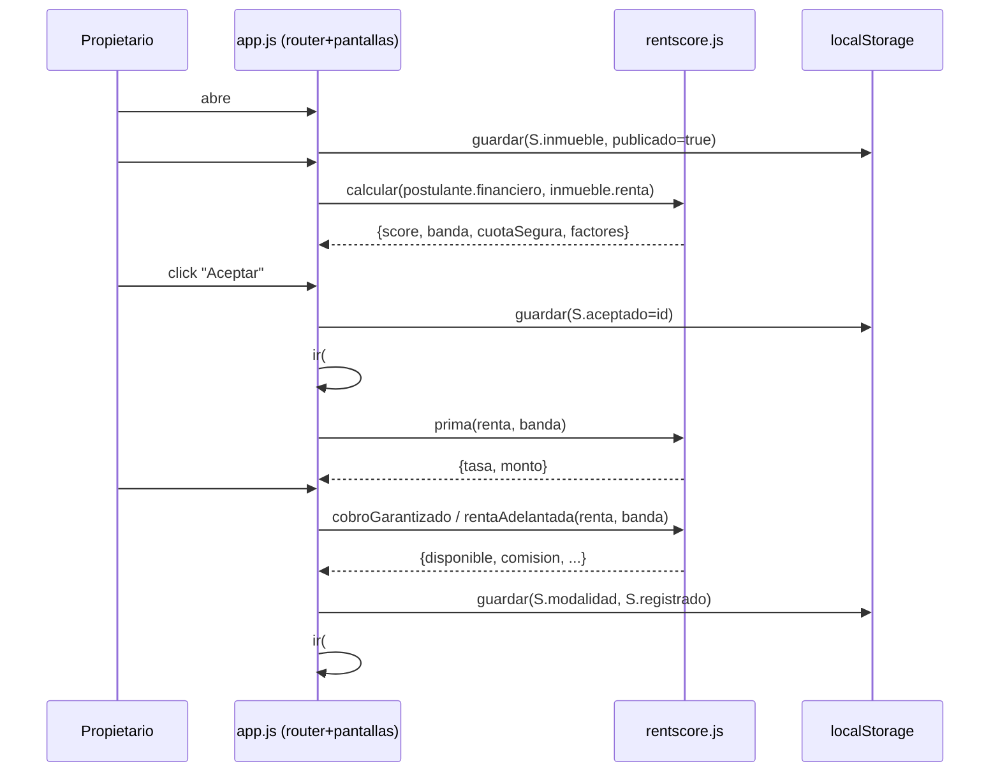

# System Architecture — LLAVE Prototipo

## System Overview

Aplicación web **estática, cliente-only**, mobile-first, sin backend, sin build y sin dependencias de runtime instalables. Se abre con doble clic en `prototype/src/index.html` (o se sirve estático). Toda la lógica corre en el navegador con JavaScript vanilla (ES5-compatible, patrón IIFE). El estado de la demo persiste en `localStorage`. El despliegue es estático en Vercel (`vercel.json` publica solo `prototype/src` y `prototype/data`).

## Architecture Diagram

Texto alternativo: `index.html` carga en orden `datos.js`, `rentscore.js` y `app.js`, más `styles.css`. `app.js` lee `LLAVE_DATA`, invoca `RentScore`, renderiza dentro de `main#app` y sincroniza el estado con `localStorage` bajo la clave `llave-demo-v1`.

## Component Descriptions

### index.html
- **Purpose**: Shell de la app y orden de carga de scripts.
- **Responsibilities**: Header con logo/rol, barra de progreso (`#prog`), contenedor `#app`, footer con botón "Reiniciar demo". Carga tipografía Montserrat de Google Fonts. `noindex,nofollow`.
- **Dependencies**: `styles.css`, `../data/datos.js`, `rentscore.js`, `app.js`.
- **Type**: Application (view shell).

### styles.css (320 líneas)
- **Purpose**: Estilos y sistema visual.
- **Responsibilities**: Define tokens como variables CSS (colores, tipografía, espaciado, radios), layout responsive (1 columna en móvil, 2-3 desde 720px, contenedor 896px), componentes visuales (tarjetas, badges, gauge, barra de mercado).
- **Type**: Application (styles).

### datos.js (`window.LLAVE_DATA`, 53 líneas)
- **Purpose**: Fuente única de datos ficticios.
- **Responsibilities**: `propietaria`, `inmueble`, `referenciaMercado`, `postulantes[]` (con `declarado` y `financiero`), `hoy`.
- **Dependencies**: Ninguna.
- **Type**: Model / Data.

### rentscore.js (`window.RentScore`, 114 líneas)
- **Purpose**: Motor de reglas de negocio, función pura.
- **Responsibilities**: `calcular(f, renta)`, `prima(renta, banda)`, `cobroGarantizado(renta, banda)`, `rentaAdelantada(renta, banda)`. Exporta vía `module.exports` si existe (compatible con test en Node) o `root.RentScore`.
- **Dependencies**: Ninguna (sin datos ni DOM).
- **Type**: Application (domain logic).

### app.js (555 líneas)
- **Purpose**: Controlador de la SPA.
- **Responsibilities**: Estado (`estadoInicial`/`cargar`/`guardar`), utilidades (formato soles/pct, `esc` anti-XSS, iconos e ilustraciones SVG inline), definición de las 9 pantallas (objeto `P`), router por `hashchange`, foco/accesibilidad.
- **Dependencies**: `window.LLAVE_DATA`, `window.RentScore`, DOM (`#app`, `#hd`, `#rol`, `#prog`, `#reiniciar`).
- **Type**: Application (controller/view).

## Data Flow

Secuencia de una aceptación (journey feliz del propietario):

Texto alternativo: El propietario publica el inmueble (se persiste). Navega a los postulantes; `app.js` invoca `rentscore.calcular` para mostrar el score. Al aceptar, se guarda el id aceptado y se calcula la prima. En la pantalla de cobro se calculan las modalidades por banda; al confirmar se guarda la modalidad y se muestra la confirmación.

## Integration Points

- **External APIs**: Ninguna. No hay llamadas de red salvo la hoja de Google Fonts.
- **Databases**: Ninguna. Persistencia local en `localStorage` (clave `llave-demo-v1`).
- **Third-party Services**: Google Fonts (Montserrat); Vercel (hosting estático). Interbank/Interseguro solo como marca; **sin ninguna integración real**.

## Infrastructure Components

- **CDK Stacks**: Ninguno.
- **Deployment Model**: Sitio estático. `vercel.json` (en la raíz del repo) copia `prototype/src` y `prototype/data` a `public/`, dejando fuera `context/`, `decisions/` y originales. Página con `noindex`.
- **Networking**: N/A (estático).
