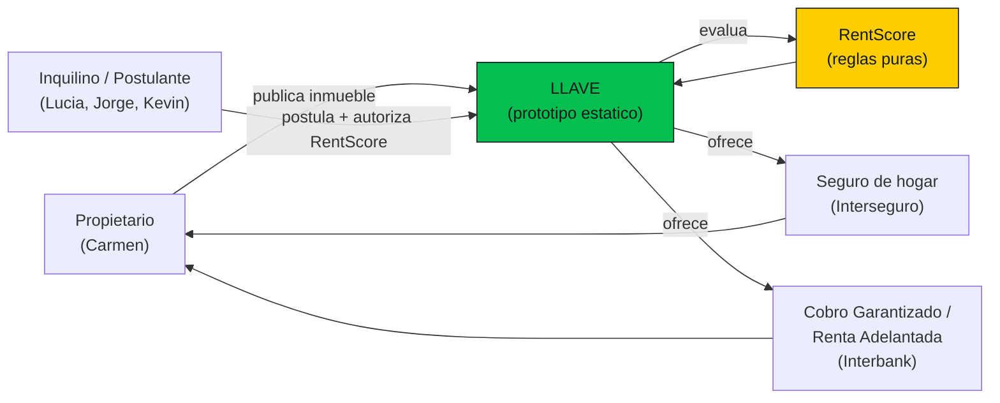

# Business Overview — LLAVE (Prototipo del Equipo 22, The Bet)

> Ingeniería inversa del prototipo existente en `prototype/`. Todos los datos del prototipo son ficticios. Este documento describe lo que el código **implementa hoy**, no el producto completo del Big Idea.

## Business Context Diagram

Texto alternativo: El propietario publica su inmueble en LLAVE. Los inquilinos postulan y autorizan el cálculo de su RentScore. LLAVE evalúa con RentScore (reglas puras), ofrece un seguro de hogar (Interseguro) que paga el inquilino, y modalidades financieras (Cobro Garantizado / Renta Adelantada de Interbank) que elige el propietario.

## Business Description

**Qué hace el sistema (hoy, en el prototipo).** LLAVE es un prototipo navegable, mobile-first y sin backend, que demuestra el journey del **propietario** que alquila un inmueble: publicar, recibir postulantes, ver el **RentScore** de cada uno (0-100), aceptar a uno, ver la póliza de seguro de hogar (que paga el inquilino) y elegir cómo cobrar la renta (estándar, Cobro Garantizado o Renta Adelantada). Es una herramienta de alineación para el taller AI-DLC y para la demo ante el jurado, no un producto validado.

**Los tres dolores del propietario que el modelo resuelve** (marco de negocio, ver `prototype/docs/historias-inquilino.md`):
1. Saber a quién le alquila → **RentScore**.
2. Que le paguen puntual → **Cobro Garantizado / Renta Adelantada**.
3. Que no le destruyan la casa → **seguro de hogar** que paga el inquilino.

## Business Transactions (implementadas en el prototipo)

| # | Transacción | Descripción | Estado en el código |
| --- | --- | --- | --- |
| BT-01 | Publicar inmueble | El propietario captura/edita tipo, dirección, distrito, dormitorios, área y renta; marca el inmueble como publicado. | Implementada (`P.publicar`) |
| BT-02 | Listar postulantes | Ver los 3 postulantes ficticios con su banda de score. | Implementada (`P.postulantes`) |
| BT-03 | Ver detalle de postulante | Datos declarados (sin verificar) vs. RentScore verificado. | Implementada (`P.postulante`) |
| BT-04 | Ver autorización del postulante | Constancia de solo lectura de lo que el postulante autorizó. | Implementada (`P.consentimiento`) |
| BT-05 | Calcular y mostrar RentScore | Score 0-100, banda, cuota segura, factores y comparación con el mercado. | Implementada (`P.resultado` + `rentscore.calcular`) |
| BT-06 | Aceptar postulante | Fija el postulante aceptado y avanza a la póliza. | Implementada (`P.resultado.montar`) |
| BT-07 | Emitir póliza (simulada) | Muestra prima escalonada por banda; costo S/0 para el propietario. | Implementada (`P.poliza` + `rentscore.prima`) |
| BT-08 | Elegir modalidad de cobro | Estándar / Cobro Garantizado / Renta Adelantada, según disponibilidad por banda. | Implementada (`P.cobro` + `cobroGarantizado`/`rentaAdelantada`) |
| BT-09 | Confirmar solicitud (simulada) | Resumen final de inquilino, seguro, modalidad y costo para el propietario. | Implementada (`P.confirmacion`) |
| BT-10 | Reiniciar demo | Restablece el estado a inicial. | Implementada (botón "Reiniciar demo") |

**Transacciones documentadas pero NO implementadas (backlog).** Todo el **journey del inquilino** (marketplace sin registro, ficha de propiedad, lead form al postular, consentimiento en dos capas, ver el propio RentScore, enviar/retirar postulaciones, aviso de deudor, indicador de bancarización) está descrito en `prototype/docs/historias-inquilino.md` (HU-01 a HU-12) pero **no existe en el código**. Ver `code-quality-assessment.md`.

## Business Dictionary

| Término | Significado en el sistema |
| --- | --- |
| RentScore | Puntaje 0-100 de un postulante calculado por reglas puras (sin ML) sobre datos financieros ficticios. Bandas: bajo 0-39, medio 40-69, alto 70-100. |
| Banda | Clasificación del score: `alto`, `medio`, `bajo`. Determina prima del seguro y disponibilidad de modalidades financieras. |
| Cuota segura | Capacidad de pago recomendada = 30% del ingreso mensual, redondeado hacia abajo a S/50. Supuesto. |
| Seguro de hogar | Póliza que contrata y **paga el inquilino** para proteger el inmueble de daños. No cubre impago ni reemplaza la garantía. Prima 2-5% de la renta, escalonada por banda. |
| Cobro Garantizado | Interbank deposita la renta menos comisión (3% alto, 5% medio) cada mes, pague o no el inquilino. No disponible con banda baja. |
| Renta Adelantada | Desembolso único de la renta anual (12 meses) menos comisión (15% alto, 25% medio). No disponible con banda baja. Estructurado como préstamo de consumo a tasa cero (decisión 016). |
| Deudor (niveles 2 y 3) | En Cobro Garantizado / Renta Adelantada, el inquilino figura como deudor del préstamo; el propietario es el beneficiario y absorbe la comisión (decisión 018). |

## Component Level Business Descriptions

### Journey del propietario (`prototype/src/app.js`)
- **Purpose**: Demostrar de punta a punta cómo un propietario alquila con seguridad de cobro y protección del inmueble.
- **Responsibilities**: Renderizar las 9 pantallas del flujo, mantener el estado de la demo, aplicar las reglas de RentScore a la decisión de aceptación y cobro.

### Motor RentScore (`prototype/src/rentscore.js`)
- **Purpose**: Traducir datos financieros en un puntaje explicable y en las condiciones comerciales (prima, comisiones).
- **Responsibilities**: `calcular` (score, banda, cuota segura, factores), `prima`, `cobroGarantizado`, `rentaAdelantada`. Función pura, sin efectos secundarios.

### Datos ficticios (`prototype/data/datos.js`)
- **Purpose**: Proveer el escenario de la demo (propietaria, inmueble, 3 postulantes, referencia de mercado).
- **Responsibilities**: Ser la única fuente de datos; se carga como script global (`window.LLAVE_DATA`).

### Design system (`prototype/design-system/`)
- **Purpose**: Referencia visual y de contenido derivada del portal Zona Hipotecaria de Interbank.
- **Responsibilities**: Tokens (`tokens.json`) y 10 componentes de referencia con `preview.html`. No es librería importable.
