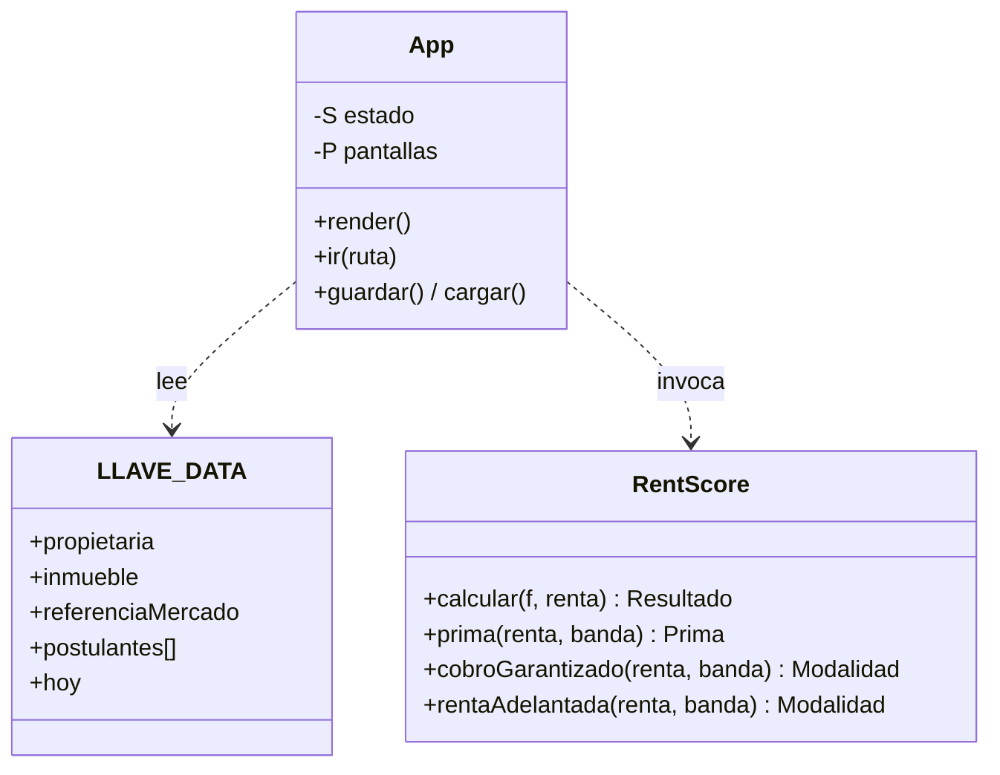

# Code Structure — LLAVE Prototipo

## Build System
- **Type**: Ninguno. No hay `package.json`, ni bundler, ni transpilador. JavaScript vanilla compatible con navegador (patrón IIFE, estilo ES5).
- **Configuration**: `vercel.json` en la raíz para publicar el sitio estático. Tipografía vía CDN (Google Fonts).
- **Cómo correr**: abrir `prototype/src/index.html` con doble clic o servir la carpeta como estática.

## Existing Files Inventory

Candidatos a modificación en un cambio brownfield:

- `prototype/src/index.html` — Shell HTML: header (logo + rol), barra de progreso, `main#app`, footer con "Reiniciar demo". Orden de carga de scripts.
- `prototype/src/styles.css` (320 líneas) — Tokens como variables CSS, layout responsive, estilos de todos los componentes visuales (tarjetas, badges, gauge, barra de mercado, formularios).
- `prototype/src/rentscore.js` (114 líneas) — Motor de reglas puro: `calcular`, `prima`, `cobroGarantizado`, `rentaAdelantada`. Sin dependencias.
- `prototype/src/app.js` (555 líneas) — Router por hash, estado en `localStorage`, 9 pantallas del journey del propietario, utilidades de render e ilustraciones SVG.
- `prototype/data/datos.js` (53 líneas) — Datos ficticios: propietaria, inmueble, referencia de mercado, 3 postulantes.
- `prototype/design-system/tokens.json` — Fuente de verdad de tokens (color, tipografía, espaciado, radios, sombras, tamaños), con procedencia (Medido/Estimado/Ajustado/Propuesto).
- `prototype/design-system/README.md` — Fundamentos de contenido y visuales.
- `prototype/design-system/components/*/` — 10 componentes de referencia (Button, ConsentBlock, Cover, CtaBanner, NavHeader, PropertyCard, RentScoreCard, SearchFilters, SolutionOption, StatusBadge), cada uno con `README.md` y `preview.html` estático.
- `prototype/docs/historias-inquilino.md` — Historias de usuario del flujo del inquilino (HU-01 a HU-12). **No implementadas** en el código.
- `prototype/docs/supuestos.md` — Todos los valores etiquetados como SUPUESTO en pantalla.

## Key Modules

Texto alternativo: `App` (app.js) depende de `LLAVE_DATA` (datos.js) y de `RentScore` (rentscore.js). `RentScore` no depende de nadie. `LLAVE_DATA` es solo datos.

## Design Patterns

### Module pattern (IIFE)
- **Location**: `app.js`, `rentscore.js`, `datos.js`.
- **Purpose**: Encapsular sin contaminar el ámbito global salvo `window.LLAVE_DATA` y `window.RentScore`.
- **Implementation**: `(function(root){ ... })(this)`.

### Hash router + tabla de pantallas
- **Location**: `app.js` — objeto `P` con una entrada por pantalla; cada entrada tiene `paso`, `titulo`, `html(id)` y opcional `montar(id)`.
- **Purpose**: Navegación SPA sin librería. `render()` se dispara en `hashchange`.
- **Implementation**: Se parsea `location.hash`, se resuelve `P[nombre]`; rutas inválidas o postulante inexistente redirigen a inicio.

### Función pura de dominio con tabla de tramos
- **Location**: `rentscore.js` — helper `tramo(valor, cortes)` recorre pares `[predicado, puntos]`.
- **Purpose**: Scorecard explicable y fácil de ajustar.
- **Implementation**: 5 factores ponderados (renta/ingreso 30, estabilidad 20, deuda 20, puntualidad 20, antigüedad 10).

### Escape HTML manual (mitigación XSS)
- **Location**: `app.js` — función `esc()` aplicada a todo dato interpolado en `innerHTML`.
- **Purpose**: Evitar inyección al construir HTML por concatenación de strings.

## Critical Dependencies

### Google Fonts (Montserrat)
- **Version**: N/A (CDN).
- **Usage**: `<link>` en `index.html`.
- **Purpose**: Tipografía de marca (fallback a system-ui/Arial).

No hay dependencias de paquetes (sin `node_modules`, sin lockfile).
