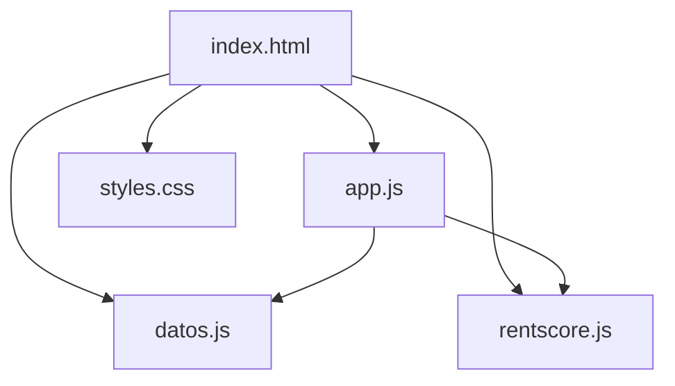

# Dependencies — LLAVE Prototipo

## Internal Dependencies

Texto alternativo: `index.html` carga `datos.js`, `rentscore.js`, `app.js` y `styles.css`. En tiempo de ejecución, `app.js` depende de `datos.js` (datos) y de `rentscore.js` (reglas). El orden de carga en el HTML garantiza que `LLAVE_DATA` y `RentScore` existan antes de `app.js`.

### app.js depende de datos.js
- **Type**: Runtime.
- **Reason**: Lee `window.LLAVE_DATA` (propietaria, inmueble, postulantes, referencia de mercado).

### app.js depende de rentscore.js
- **Type**: Runtime.
- **Reason**: Invoca `window.RentScore.calcular/prima/cobroGarantizado/rentaAdelantada`.

### rentscore.js
- **Type**: Sin dependencias internas. Función pura, apta para reutilizar en un backend o en pruebas.

## External Dependencies

### Google Fonts — Montserrat
- **Version**: N/A (CDN).
- **Purpose**: Tipografía de marca; fallback a `system-ui`/`Arial`.
- **License**: SIL Open Font License.

No hay dependencias de paquetes gestionadas (sin `package.json`, sin lockfile, sin `node_modules`).

## Acoplamiento de contrato de datos
El motor `rentscore.js` asume una forma exacta de `f` (`ingresoMensual`, `mesesIngresoEstable`, `ratioDeuda`, `pagosPuntuales`, `aniosCliente`). Cualquier cambio en el esquema de `postulantes[].financiero` en `datos.js` debe reflejarse en `calcular`. Este es el punto de acoplamiento más relevante para futuros cambios.
