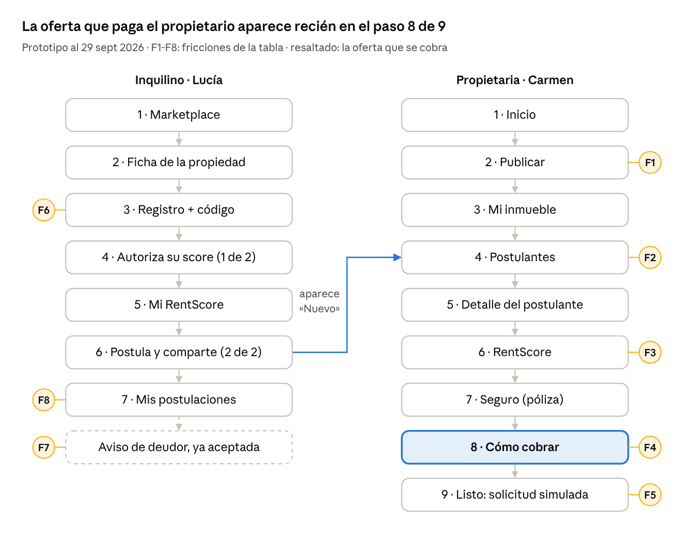
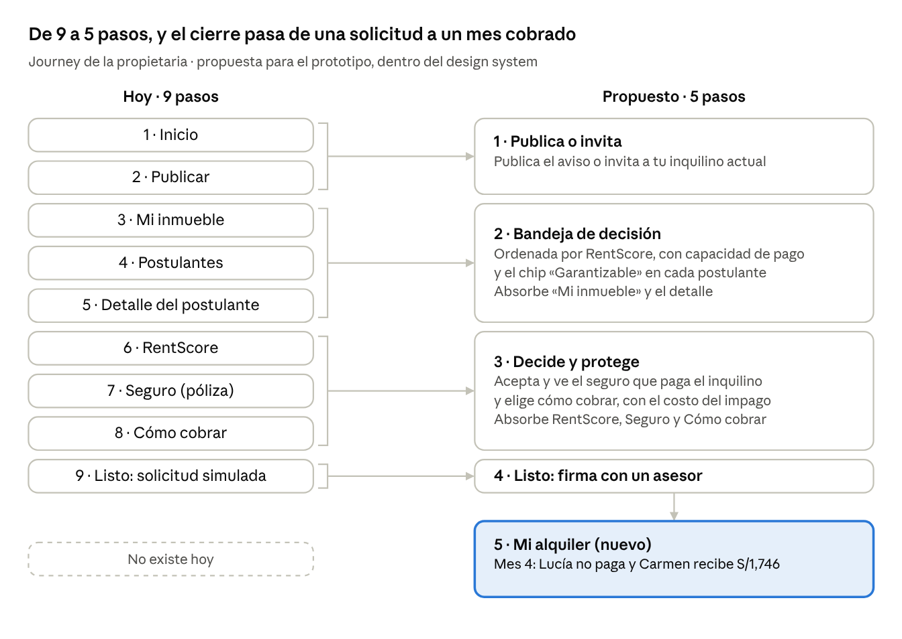
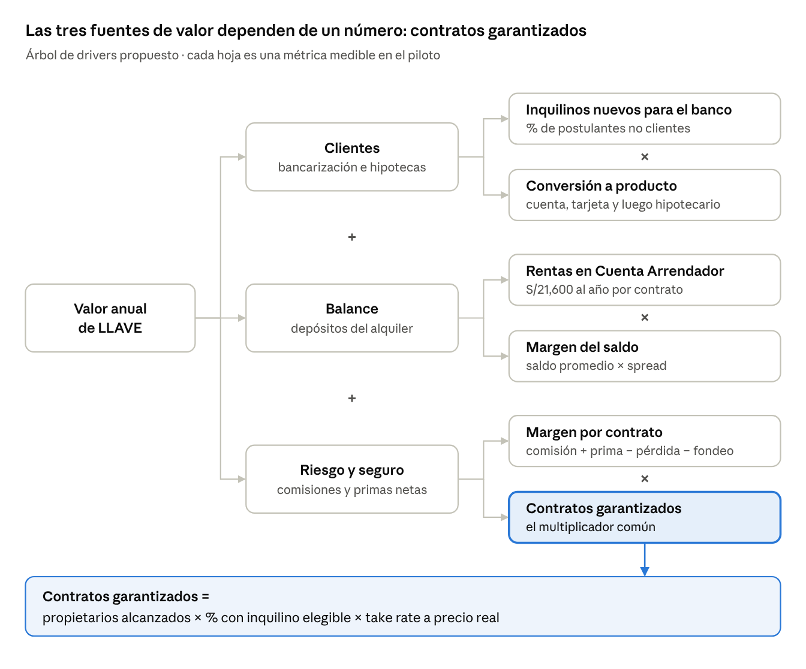
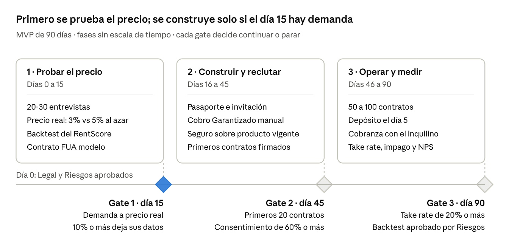

# La Llave — Recomendaciones iniciales para la final

> **Qué es:** copia versionada del doc vivo «La Llave — Recomendaciones iniciales para la final» en Claude Docs ([enlace](https://claude.ai/code/artifact/4eed856b-4c08-4bb7-ad2a-a13550ff75b1); solo lo abre quien tenga acceso compartido). Si ambos difieren, manda esta copia hasta que un PR la actualice.
>
> **Fecha:** 29 sept 2026. **Autor:** Diego Moscoso, con Claude. **Estado:** propuesta para discusión del equipo; no cierra ninguna decisión.
>
> **Relación con decisiones:** las propuestas que cambian decisiones vigentes están abiertas en `decisions/021` a `decisions/025`. Los hechos verificados están en `03-mercado-y-fuentes.md`.
>
> **Cómo se hizo:** recorrido del prototipo (`prototype/app`) en tamaño móvil, lectura del repo al 29 sept 2026, verificación de fuentes externas y una revisión adversarial con rol de jurado.

## Resumen ejecutivo

LLAVE ya tiene lo más difícil: un dolor claro y dos journeys conectados que se pueden demostrar. Hoy puntuaría por debajo de su potencial por cuatro huecos: el impacto no tiene cifra propia, la novedad se afirma de forma frágil, el MVP es muy ancho para 90 días y la demo termina antes de cumplir la promesa.

**La frase de 30 segundos (propuesta).** Casi 1 de cada 4 viviendas de Lima se alquila y el propietario elige inquilino a ciegas. Con LLAVE, Interbank evalúa al inquilino e Interseguro protege el inmueble; el propietario cobra el día 5, pague o no el inquilino. Y el inquilino construye historial crediticio pagando su alquiler, algo que hoy no le suma.

Las seis jugadas que más suben el puntaje, en orden de prioridad:

| # | Jugada | Criterio que mueve | Qué cambia en concreto |
| --- | --- | --- | --- |
| 1 | Mostrar la promesa cumplida | Impacto 40% | La demo llega al mes 4: Lucía no paga y Carmen recibe S/1,746 igual, el día 5 |
| 2 | Hacer coherente la política de riesgo | Factibilidad 30% | No ofrecer garantía si la renta supera la capacidad de pago; hoy se le ofrece a Jorge |
| 3 | Poner cifra propia al impacto | Impacto 40% | Caso base por contrato, una North Star y 20-30 entrevistas con prueba de precio real |
| 4 | Abrir los contratos que ya existen | Impacto 40% | «Garantiza a tu inquilino actual» al renovar y un Pasaporte RentScore que sirva en cualquier aviso |
| 5 | Defender la novedad con precisión | Innovación 30% | «En el Perú no encontramos garantía de renta, y los casos de la región son proptechs o aseguradoras, no bancos» en vez de «no existe en Latinoamérica» |
| 6 | Recortar el MVP a lo operable | Factibilidad 30% | Cobro Garantizado con estructura cerrada con Legal y tope de pérdida en soles; Renta Adelantada solo con score alto |

**Hallazgo crítico de la verificación.** La frase del Big Idea de que no hay un jugador equivalente en Latinoamérica es falsa: QuintoAndar, Houm y Homie ya garantizan rentas. Además, QuintoAndar es dueña de Urbania y Adondevivir desde 2021, y aún no garantiza rentas aquí: el jurado preguntará qué sabemos que ellos no.

Las cifras de este documento son supuestos del prototipo o cálculos ilustrativos, salvo que se cite una fuente. Las propuestas que cambian decisiones vigentes quedan abiertas en las decisiones 021 a 025 del repositorio. El dato de vivienda viene del Censo 2017 del INEI (23.9% de las viviendas de la provincia de Lima), ya registrado en `context/03-mercado-y-fuentes.md`.

## Diagnóstico: dónde se pierde valor hoy

La oferta por la que paga el propietario aparece recién en el paso 8 de 9, y la demo termina sin mostrar que esa oferta se cumple.

El cambio de navegación de hoy cerró el círculo: Lucía postula desde el marketplace y aparece como «Nuevo» en la bandeja de Carmen. El consentimiento en dos capas, la revocación y las etiquetas SUPUESTO dan una base de confianza que el jurado va a valorar. La base técnica (providers simulados y 64 pruebas) permite cambiar lo simulado por integraciones reales sin rehacer pantallas.

La guía navegable del prototipo (decisión 020) documenta sus 19 rutas con 24 capturas: el jurado puede recorrerlo sin ayuda.



Lucía llega a la bandeja de Carmen desde su paso 6; Carmen ve la oferta que paga recién en su paso 8 y nunca ve un mes cobrado.

| # | Dónde | Qué pasa hoy | Por qué le importa al jurado |
| --- | --- | --- | --- |
| F1 | Publicar | Dice «Se publica en el portal que ya usas», pero la decisión 017 creó un marketplace propio. No pide plazo del contrato ni garantía | Incoherencia visible. Renta Adelantada exige contrato de 1 año y ese dato no se captura |
| F2 | Mi inmueble → Postulantes → Detalle | Tres pantallas antes de ver un score completo. La bandeja no ordena ni dice quién es garantizable | La tarea del propietario es elegir, y la pantalla no lo ayuda a comparar |
| F3 | RentScore | Jorge (56, medio) recibe ambas garantías aunque la renta, S/1,800, supera su capacidad de pago, S/1,600 | Un CEO de banco lo leerá como política de riesgo laxa |
| F4 | Cómo cobrar | Tres opciones con el mismo peso y sin el costo del impago a la vista. Con score medio, Renta Adelantada da S/16,200 por un año de S/21,600 | Sin ancla de pérdida el precio parece caro; la tasa implícita (TEA 74-95%, decisión 016) no aparece |
| F5 | Listo | Termina en «Solicitud registrada · un asesor te contactará» | La promesa nunca se ve cumplida y no hay relación mes a mes, que es donde está el valor |
| F6 | Registro → Autorización → Mi RentScore | Datos, código y dos consentimientos antes del primer beneficio. El score solo sirve dentro de LLAVE | Todo depende de que el marketplace propio tenga inventario y tráfico |
| F7 | Aviso de deudor | Lucía se entera de que será deudora recién al ser aceptada, detrás de un enlace | Riesgo de confianza y de protección al consumidor; su beneficio (historial) no se cuenta |
| F8 | Controles de demo | «Simular: aceptada», «Precargar postulación» y «Ver como inquilino» conviven con el producto | Rompen la ilusión de producto real en una demo de 3 minutos |

F3 y F5 son las más caras: la primera resta credibilidad de riesgo y la segunda esconde el momento que vende el producto.

## UI/UX: doce cambios dentro del design system

Todo cabe en el design system actual: tokens de `tokens.json`, forma firma en tarjetas, un solo botón primario por vista y los 10 componentes existentes. Solo hacen falta tres piezas nuevas con esos mismos tokens: la bandeja comparativa, la línea de pagos y el pasaporte.

El cambio de fondo es de guion: Carmen sigue siendo la protagonista y la inquilina que elige es Lucía (87, score alto, no clienta de Interbank). En papeles gana Jorge, que declara S/7,000; con datos verificados (S/5,400), gana Lucía.



Las pantallas que se fusionan no pierden contenido: el detalle del score y la póliza quedan como secciones desplegables dentro de su paso.

| # | Qué cambiar | Dónde | Piezas del design system | Criterio | Esfuerzo |
| --- | --- | --- | --- | --- | --- |
| UX1 | Crear «Mi alquiler»: 12 meses de depósitos. En el mes 4 Lucía no paga y Carmen recibe S/1,746 el día 5 | Nueva, después de Listo | Tarjeta con forma firma, StatusBadge, línea de pagos (nueva) | Impacto | M |
| UX2 | Mostrar la elegibilidad con su razón: garantía solo con banda media o alta y renta dentro de la capacidad. Jorge queda «No garantizable: la renta supera su capacidad en S/200» | RentScore y Cómo cobrar | SolutionOption no disponible, Nota | Factibilidad | S |
| UX3 | Poner el costo del impago junto al precio: «Si deja de pagar desde el mes 4: estándar S/9,000 con la garantía aplicada; garantizado S/20,952 por S/648 al año» | Cómo cobrar | SolutionOption, barra comparativa con tokens | Impacto | M |
| UX4 | Convertir la bandeja en pantalla de decisión: ordenar por score, chips «Garantizable», «Renta mayor a su capacidad» y «Nuevo»; absorber «Mi inmueble» | Postulantes | PropertyCard, StatusBadge, RentScoreCard compacta | Impacto | M |
| UX5 | Agregar «Garantiza a tu inquilino actual» al renovar: enlace por WhatsApp para que autorice su RentScore, acepte el seguro y firme un contrato nuevo en FUA | Inicio, CTA secundario | CtaBanner, Button, ConsentBlock | Impacto | M |
| UX6 | Crear un modo presentador: controles de demo, cambio de rol y panel fuera del producto, con un guion de 3 minutos | Toda la app | Estilo «demo» actual, en un panel lateral | Factibilidad | S |
| UX7 | Pasaporte RentScore: tarjeta compartible por enlace o QR con banda, identidad verificada y vigencia | Mi RentScore | RentScoreCard, ConsentBlock, Button | Innovación | M |
| UX8 | Contar antes el beneficio y el aviso de deudor: sello «Acepta pago garantizado» en la ficha y resumen del préstamo antes de firmar | Ficha, Postular, aviso de deudor | StatusBadge, CtaBanner, ConsentBlock | Innovación | S |
| UX9 | Corregir Publicar: «Se publica en LLAVE», y pedir plazo del contrato y garantía | Publicar | Formulario actual | Factibilidad | S |
| UX10 | Filtro «Dentro de mi cuota segura» y acciones concretas para subir el score | Marketplace, Mi RentScore | SearchFilters | Impacto | S |
| UX11 | Reemplazar «Paso X de 9» por los 5 pasos del journey propuesto: Publica, Elige, Protege, Firma, Cobra | Barra de progreso | NavHeader | Impacto | S |
| UX12 | En modo presentador, una sola nota «Cifras referenciales» por pantalla en vez de varias etiquetas SUPUESTO | Pantallas con montos | Nota | Factibilidad | S |

Esfuerzo estimado para el prototipo actual: S, menos de 1 día; M, de 2 a 4 días. UX1 a UX6 deberían estar listas antes del primer ensayo del pitch.

Cuatro reglas que no se negocian al cambiar la UI:

- Sin preselección en Cómo cobrar: el piloto mide la elección real del propietario.
- El ancla de pérdida es un escenario ilustrativo, no una probabilidad; se rotula así en pantalla.
- Montos siempre en soles con el formato del sistema (S/1,746) y contraste AA en todo texto.
- Cada cambio actualiza el walkthrough en el mismo PR (decisión 020): capturas, textos de la guía y `npm run check` en verde.

### Guion de la demo en 3 minutos

1. **0:00-0:20 · El dolor.** Carmen, 52, Surquillo: su último inquilino dejó de pagar cuatro meses. Hoy elige al siguiente con papeles.
2. **0:20-0:50 · Llegan tres postulantes.** Jorge declara S/7,000 y el dato verificado es S/5,400. Lucía no es clienta de Interbank y tiene 87.
3. **0:50-1:20 · La bandeja decide.** Lucía es garantizable; Jorge no, porque la renta supera su capacidad; Kevin tiene score bajo.
4. **1:20-2:00 · Decide y protege.** Carmen acepta a Lucía: el seguro de S/36 al mes lo paga Lucía, y Carmen activa Cobro Garantizado por S/54 al mes.
5. **2:00-2:30 · El mes 4.** Lucía no paga. Carmen recibe S/1,746 el día 5 e Interbank gestiona el pago con Lucía.
6. **2:30-3:00 · El cierre.** Lucía era invisible para el banco y hoy construye historial. Pedido al jurado: 90 días, un squad y un tope de pérdida en soles.

## Definiciones de negocio: del catálogo de niveles al contrato garantizado

La unidad que genera ingresos, depósitos y clientes es el contrato de alquiler que pasa por Interbank. Recomiendo definir el negocio alrededor de esa unidad, no de los cuatro niveles.

### Propuesta de valor por actor

| Actor | Qué necesita resolver | Qué le promete LLAVE | Qué paga o asume |
| --- | --- | --- | --- |
| Propietaria | Elegir bien y cobrar puntual, sin pleitos | Score verificado, renta el día 5 pague o no el inquilino, inmueble asegurado | 3-5% de cada renta (Cobro Garantizado) o 15-25% del año (Renta Adelantada) |
| Inquilino | Conseguir vivienda y demostrar que es confiable | Score gratis y portátil; cada pago puntual construye historial crediticio | Seguro de hogar de 2-5% de la renta; es deudor en los niveles 2 y 3 (decisión 018) |
| Interbank | Captar flujos y clientes nuevos | Rentas que pasan por la Cuenta Arrendador, cartera de consumo seleccionada, inquilinos nuevos para el banco | Impago y costo de fondeo |
| Interseguro | Una línea de primas con riesgo seleccionado | Primas recurrentes con suscripción apoyada en el score | Siniestros por daños |

### Nueve definiciones para cerrar antes de la final

1. **Unidad de negocio: el contrato garantizado.** Un usuario registrado no genera valor; un contrato con Cobro Garantizado sí.
2. **North Star: renta garantizada activa, en S/ al mes.** Es la suma de rentas vigentes bajo Cobro Garantizado o Renta Adelantada. Se mueve con propietarios activados, elegibilidad, take rate a precio real e impago.
3. **Hipótesis del MVP en dos partes medibles (decisión 024).** Demanda: qué % de propietarios con inquilino elegible activa Cobro Garantizado a precio real. Riesgo: la pérdida observada cabe en el tope aprobado.
4. **Sacar del centro la comparación con «lo que paga por publicar» (decisión 024).** Es una práctica de mercado y no una tarifa (corretaje de 1 mes de renta), y Cobro Garantizado al 3% ya no la supera (decisión 012).
5. **Elegibilidad, como propuesta para Riesgos (decisión 021).** Banda media o alta, renta dentro de la capacidad de pago, contrato listo para desalojo notarial y garantía en custodia como primera pérdida. La Ley 30933 exige FUA o escritura pública, dos cláusulas y una cuenta de abono en una entidad supervisada por la SBS. La Cuenta Arrendador cumple ese papel.
6. **Renta Adelantada solo con score alto en el MVP (decisión 022).** Con score medio la TEA implícita es 74-95% (decisión 016) y el propietario cede 3 meses de renta para adelantar 12. Queda bajo el tope del BCRP para consumo (114.13% en soles, mayo-octubre 2026), pero ese tope está en debate.
7. **Un «sí» racional para el inquilino.** Score gratis y portátil, historial positivo con cada pago y una ruta visible al hipotecario. Si se ofrece 1 mes de garantía en vez de 2, el equilibrio empeora (tabla de sensibilidad).
8. **Adquisición desde la base, con Legal.** Los clientes que reciben transferencias recurrentes de montos de alquiler son propietarios probables. Usar ese dato exige revisar la Ley 29733 y el secreto bancario antes de cualquier campaña.
9. **Estructura de Cobro Garantizado, a cerrar con Legal (decisión 025).** Hoy es un préstamo a tasa cero al inquilino (016 y 018). Si el inquilino repone cada renta en menos de ~24 días, la comisión de 5% equivale a una TEA mayor al tope de 114.13%. Evaluar una garantía con comisión: el inquilino solo es deudor si Interbank paga por él, y eso cambia cómo construye historial.

Gobierno sugerido: un solo dueño de producto, P&L de nivel 1 en Interseguro y de niveles 2-3 en Interbank, y la North Star como KPI compartido.

### Economía por contrato, con renta de S/1,800

| Concepto | Score alto | Score medio | Tipo de cifra |
| --- | --- | --- | --- |
| Prima de seguro que paga el inquilino, al año | S/432 (2%) | S/756 (3.5%) | Supuesto del prototipo sobre la decisión 010 |
| Comisión de Cobro Garantizado, al año | S/648 (3%) | S/1,080 (5%) | Decisión 012, sin sustento actuarial |
| Ingreso directo del grupo, al año, antes de pérdidas | S/1,080 | S/1,836 | Cálculo: prima más comisión |
| Comisión de Renta Adelantada, una vez | S/3,240 (15%) | S/5,400 (25%) | Decisión 016, sin sustento actuarial |
| Renta que pasa por Interbank, al año | S/21,600 | S/21,600 | Flujo, no ingreso |

```latex
P_{\text{equilibrio}} = \frac{\text{comisión anual}}{(\text{meses sin pago} - \text{meses de garantía}) \times \text{renta}} = \frac{648}{(9 - 2) \times 1{,}800} = 5.1\%
```

El escenario base es el mismo de la demo: el inquilino deja de pagar desde el mes 4 hasta el fin del contrato y la garantía de 2 meses cubre la primera pérdida. El equilibrio es la probabilidad anual de un impago así que la comisión alcanza a cubrir, sin fondeo ni costos operativos.

| Supuesto de impago | Score alto (3%) | Score medio (5%) |
| --- | --- | --- |
| 9 meses sin pago, 2 de garantía (base) | 5.1% | 8.6% |
| 6 meses sin pago, 2 de garantía | 9.0% | 15.0% |
| 9 meses sin pago, 1 de garantía | 4.5% | 7.5% |

Riesgos debe reemplazar estos supuestos con datos propios: `context/03` registra desalojos judiciales de 12 a 24 meses. Si el desalojo notarial acorta ese plazo o el reporte a centrales disuade el impago, el margen mejora.



El caso base de la decisión 011 debería construirse hoja por hoja, empezando por contratos garantizados. Balance y clientes se presentan como valor adicional, no como la promesa principal.

## Puntaje: de 2.65 a 4.15 sobre 5

Con las seis jugadas, el puntaje ponderado estimado sube de 2.65 a 4.15 sobre 5. Impacto y factibilidad aportan lo mismo al alza, 0.6 puntos cada uno; factibilidad es hoy el criterio más débil.

| Criterio | Peso | Hoy | Potencial | Qué lo baja hoy | Qué lo sube |
| --- | --- | --- | --- | --- | --- |
| Impacto potencial | 40% | 2.5 | 4.0 | Cifras heredadas de la herramienta de IA, sin ingresos para los niveles 2 y 3 y sin evidencia de demanda | Caso base por contrato (decisión 011), North Star, entrevistas con prueba de precio y contratos ya existentes |
| Necesidad y enfoque innovador | 30% | 3.5 | 4.5 | Dolor real pero sin entrevistas formales; «no existe en Latinoamérica» es falso | Novedad acotada con fuentes (en el Perú no encontramos garantía de renta), el alquiler como historial crediticio y el pasaporte portátil |
| Factibilidad (MVP en 90 días) | 30% | 2.0 | 4.0 | Cuatro niveles, marketplace propio y dos productos de crédito sin aprobación de Riesgos, Legal ni SBS | Estructura legal cerrada antes del día 0, tope de pérdida en soles, Renta Adelantada acotada y marketplace liviano |
| **Total ponderado** | 100% | **2.65** | **4.15** | | |

Es una estimación cualitativa para priorizar, hecha sobre el repositorio al 29 sept 2026. No predice la nota del jurado.

## El challenge Shark Tank: 16 preguntas que hay que ganar

El jurado va a atacar riesgo, legalidad y demanda antes que la interfaz. Cada respuesta debe caber en dos frases y apoyarse en un dato.

| # | Pregunta probable | Respuesta preparada | Evidencia que falta |
| --- | --- | --- | --- |
| 1 | ¿Por qué pagaría un propietario si hoy no paga nada? | Hoy paga el impago con meses de renta perdidos. Con Cobro Garantizado paga S/648 al año y, si el inquilino deja de pagar desde el mes 4, protege S/11,952 ya descontada la garantía | 20-30 entrevistas y prueba de precio real |
| 2 | ¿Esto ya existe? | Sí, fuera del Perú: QuintoAndar, Houm, Homie y el seguro de arrendamiento colombiano. En el Perú no encontramos una garantía de renta, y ninguno de esos casos es un banco con datos propios | Tabla de precedentes, abajo |
| 3 | QuintoAndar tiene Urbania y Adondevivir desde 2021 y no garantiza rentas aquí: ¿qué sabe que ustedes no? | Nuestra hipótesis: sin contrato formal ni desalojo rápido, la garantía no cierra. Por eso solo garantizamos contratos de la Ley 30933 con la renta pagada en cuenta | Medir en entrevistas cuántos propietarios aceptan formalizar, incluido el efecto tributario |
| 4 | ¿Cuánto riesgo asume Interbank y cuánto capital consume? | Una exposición por contrato, acotada por score, capacidad de pago, garantía en custodia y desalojo notarial. El piloto opera con un tope de pérdida en soles aprobado antes del día 0 | Tope aprobado por Riesgos y tratamiento de provisiones |
| 5 | ¿Una TEA implícita de hasta 95% es legal y presentable? | Está bajo el tope del BCRP para consumo (114.13% en soles, mayo-octubre 2026), pero el tope está en debate. Por eso proponemos Renta Adelantada solo con score alto (36-44%) y con TCEA visible | Opinión de Legal sobre transparencia |
| 6 | ¿Cobro Garantizado es un crédito, una fianza o un seguro? | Hoy es un préstamo a tasa cero; si el inquilino repone la renta en menos de ~24 días, el 5% supera el tope. Proponemos evaluar con Legal una garantía con comisión (decisión 025) | Estructura cerrada con Legal |
| 7 | ¿Por qué aceptaría el inquilino ser deudor y pagar un seguro? | Porque su alquiler puntual construye historial y lo acerca a un hipotecario. Además, su score es gratis y le sirve en cualquier aviso | Encuesta a inquilinos y tasa de consentimiento del piloto |
| 8 | ¿Cómo recuperan el inmueble si no paga? | Con contratos listos para desalojo notarial (Ley 30933): FUA o escritura pública, dos cláusulas y la renta abonada en una cuenta supervisada por la SBS. La Cuenta Arrendador cumple ese requisito | Modelo de contrato revisado por Legal |
| 9 | ¿Cómo evitan la selección adversa? | El seguro y la garantía solo se ofrecen después del score. Son elegibles las bandas media y alta con renta dentro de la capacidad de pago | Reglas aprobadas por Riesgos (decisión 021) |
| 10 | ¿Cómo verifican el ingreso de quien no es cliente? | Hoy el prototipo lo simula. Con su consentimiento, el inquilino sustenta su ingreso; mientras no esté verificado, se usa una capacidad de pago conservadora | Fuente de ingreso para no clientes definida con Riesgos |
| 11 | ¿Qué aprenden de riesgo en solo 90 días? | Poco, y lo decimos: con 100 contratos jóvenes, incluso 10% de impago anual daría 1 o 2 casos. El riesgo se estima con un backtest y se confirma con 12 meses de seguimiento | Backtest del RentScore sobre clientes que ya pagan alquiler por transferencia, con Legal |
| 12 | ¿Para qué un marketplace si ya existen portales? | No competimos por avisos: el Pasaporte RentScore funciona en cualquier aviso, y el marketplace es la vitrina mínima del piloto | Costo de tráfico y revisión de la 017 (decisión 023) |
| 13 | ¿Cómo consiguen propietarios sin gastar en medios? | Muchos ya están en la base: clientes que reciben transferencias recurrentes de montos de alquiler. Se usará solo con aprobación de Legal | Conteo validado por Legal y Compliance |
| 14 | ¿De qué tamaño es la oportunidad? | La provincia de Lima tenía 520,202 viviendas alquiladas en 2017; el equipo estima 650-700 mil hogares hoy. Por contrato de S/1,800, el grupo cobra S/1,080 a S/1,836 al año antes de pérdidas | Caso base de la decisión 011 |
| 15 | ¿Qué pasa con los datos y el sesgo del algoritmo? | El propietario ve score y capacidad, nunca movimientos ni saldos. El consentimiento es granular y revocable, y el score se explica por factores | Revisión de Legal (Ley 29733) y de Riesgos sobre las variables |
| 16 | ¿Qué nos piden y cuánto podemos perder? | Noventa días, un squad de cinco personas y un tope de pérdida. Si los 100 contratos dejaran de pagar desde el mes 4, se perderían S/1.2 millones; con 5% de impago severo, unos S/60 mil | Costo real del squad, no la cifra de IA de US$400-500K; cada Renta Adelantada expone hasta S/18,360 |

### Precedentes que el jurado puede citar

La categoría existe y escala en la región. En el Perú no encontramos una garantía de renta (búsqueda del 29 sept 2026 en aseguradoras, bancos y proptechs).

| Jugador | País | Qué ofrece hoy | Fuente |
| --- | --- | --- | --- |
| QuintoAndar | Brasil | Paga la renta aunque el inquilino no pague; el inquilino alquila sin fiador ni depósito. Garantía respaldada por Fairfax. Es dueña de Urbania y Adondevivir desde 2021 | [QuintoAndar](https://sobre.quintoandar.com.br/garantia/), [Gestión](https://gestion.pe/economia/empresas/brasilena-quintoandar-compra-grupo-navent-dueno-de-urbania-y-adondevivir-noticia/) |
| Houm | Chile | «Te pagamos el 5 cada mes», sin aval ni garantía, apoyado en aseguradoras de crédito; planes de 7% a 11.5% + IVA | [Houm](https://houm.com/cl), [La Tercera](https://www.latercera.com/pulso/noticia/la-promesa-de-la-mayor-corredora-inmobiliaria-online-de-chile-houm-apunta-a-ganar-dinero-en-2026/SNH3CUP76VDSFGJNKFGSE2XSZA/) |
| Homie | México | Renta pagada cada mes «pase lo que pase» en cinco alcaldías de CDMX. En el Perú opera desde septiembre de 2025 un multifamily de 141 departamentos en Miraflores | [Homie](https://homie.mx/marketing/landing/propietarios), [DF](https://www.df.cl/peru/homie-la-proptech-mexicana-que-se-adjudico-el-primer-multifamily-de) |
| Seguros Bolívar | Colombia | Seguro de arrendamiento que paga los cánones si el inquilino incumple | [Seguros Bolívar](https://www.segurosbolivar.com/seguro-de-arrendamiento) |
| Oferta actual en el Perú | Perú | Evaluación de inquilinos (Proper, Mi Sentinel) y carta fianza; ninguna garantía de renta encontrada | [Proper](https://landing-rentas.proper.com.pe/), [La República](https://larepublica.pe/nota-de-prensa/2024/11/05/mi-sentinel-protege-tu-inversion-revisando-el-historial-crediticio-de-tus-inquilinos-288210) |

La necesidad tiene voz propia: en 2024 la Cámara Inmobiliaria Peruana propuso un seguro contra inquilinos morosos y dijo que el alquiler «es como un crédito a mediano plazo» ([Gestión](https://gestion.pe/tu-dinero/inmobiliarias/nuevo-seguro-inmobiliario-la-propuesta-de-la-cip-para-asegurar-a-propietarios-de-inquilinos-morosos-camara-inmobiliaria-peruana-noticia/)). En la región, una aseguradora respalda la garantía; LLAVE tiene balance y aseguradora dentro del mismo grupo.

## MVP en 90 días: una promesa, tres gates

El MVP debe probar una sola promesa con contratos reales: «recibe tu renta el día 5, pague o no tu inquilino». Propongo de 50 a 100 contratos en Lima Moderna, en tres fases con un gate de continuar o parar al final de cada una.



El día 0 exige la estructura legal y el tope de pérdida aprobados; sin eso, el MVP no arranca. El gate 1 pide que 10% o más de los contactados deje sus datos ante el precio real, probado al azar a 3% y 5%.

El gate 2 pide 20 contratos firmados antes de escalar a 50-100. El gate 3 no valida riesgo: con contratos tan jóvenes, incluso 10% de impago anual daría 1 o 2 casos. Por eso el riesgo se estima con un backtest del RentScore y se confirma con 12 meses de seguimiento.

**Entra al MVP:** RentScore v0 por reglas para clientes y no clientes, con su backtest, Cobro Garantizado con tope de pérdida, seguro de hogar sobre un producto existente, «Garantiza a tu inquilino actual» al renovar, pasaporte y un marketplace liviano con avisos cargados por el equipo.

**Pasa a fase 2:** Renta Adelantada con score medio, modelo de ML, Housing Graph y expansión fuera de Lima. Renta Adelantada con score alto entra solo con un tope de contratos.

**Ruta regulatoria.** Si Legal concluye que el esquema necesita flexibilizar normas, existe el régimen de modelos novedosos de la SBS. Permite pilotos de hasta 18 meses, ampliables 12 (Res. SBS 2429-2021, modificada por la 04142-2025).

| Métrica | Cómo se mide | Umbral (propuesta) |
| --- | --- | --- |
| Interés a precio real (gate 1) | Propietarios contactados que dejan sus datos ante el precio, con 3% y 5% al azar | 10% o más |
| Contratos firmados (gate 2) | Contratos garantizados con inquilino elegible | 20 al día 45 |
| Take rate de Cobro Garantizado (gate 3) | Propietarios con inquilino elegible que lo activan a precio real | 20% o más |
| Backtest de riesgo (gate 3) | Impago histórico estimado para las bandas media y alta | Aprobado por Riesgos |
| Consentimiento del inquilino | Postulantes que autorizan su RentScore sobre los que inician | 60% o más |
| Postulantes nuevos para el banco | No clientes sobre postulantes únicos | 30% o más |
| NPS de propietarios | Encuesta a los 60 y 90 días | 40 o más |
| Costo por contrato garantizado | Gasto de adquisición sobre contratos activos | A fijar con Growth |
| Impago temprano | Contratos con al menos un mes impago | Solo monitoreo |

Los umbrales son un punto de partida para discutir con Growth y Riesgos, no metas aprobadas.

Equipo mínimo sugerido, además de los cuatro del Equipo 22: un dueño de producto, un diseñador UX, dos desarrolladores y un analista de Riesgos. Suma operaciones de cobranza a tiempo parcial y horas reservadas de Legal y de suscripción de Interseguro.

## Checklist antes de la final

Estas trece validaciones convierten supuestos en evidencia, ordenadas por cuándo deben estar listas. Las de esta semana son las que el jurado usaría para desarmar el pitch.

- [ ] **Semana del 29 sept.** 20-30 entrevistas con propietarios de 1-2 inmuebles, con guion y hallazgos en `mvp/validacion/`; medir si aceptarían formalizar el contrato y cobrar en cuenta. Sugerido: William Salinas.
- [ ] **Semana del 29 sept.** Prueba de precio con una landing real, a 3% y 5% al azar: cuántos propietarios dejan sus datos. Sugerido: Diego Moscoso.
- [ ] **Semana del 29 sept.** Revisar en equipo las decisiones abiertas 021 a 025. Todo el equipo.
- [ ] **Semana del 29 sept.** Confirmar jurado y formato de la final (decisión 014). Sugerido: William Salinas.
- [ ] **Antes del ensayo.** Riesgos valida la elegibilidad y reemplaza el supuesto de severidad (9 meses sin pago, 2 de garantía). Sugerido: Diego Herrera.
- [ ] **Antes del ensayo.** Legal define la estructura de Cobro Garantizado (préstamo a tasa cero o garantía con comisión), la TCEA, el tope de tasas y el aviso de deudor. Sugerido: Diego Herrera.
- [ ] **Antes del ensayo.** Interseguro confirma si hay un seguro de hogar vigente que se pueda reutilizar y si 2-5% de la renta es sostenible. Sugerido: William Salinas y Carlos Segura.
- [ ] **Antes del ensayo.** Encuesta corta a inquilinos: disposición a pagar el seguro y a figurar como deudor a cambio de historial. Sugerido: Carlos Segura.
- [ ] **Antes del ensayo.** Implementar UX1 a UX6 en el prototipo, con el walkthrough actualizado (decisión 020), y probar el guion de 3 minutos. Sugerido: Carlos Segura y Diego Moscoso.
- [ ] **Antes de la final.** Backtest del RentScore sobre clientes que ya pagan alquiler por transferencia, con aprobación de Legal. Sugerido: Diego Herrera y Diego Moscoso.
- [ ] **Antes de la final.** Contar, con aprobación de Legal, cuántos clientes reciben transferencias recurrentes de montos de alquiler. Sugerido: Diego Moscoso.
- [ ] **Antes de la final.** Cerrar la decisión 011 con un caso base en soles: contratos, prima promedio, take rate, horizonte y costo del squad. Sugerido: William Salinas.
- [ ] **Antes de la final.** Ensayar con un «abogado del diablo» usando las preguntas del challenge. Todo el equipo.

## Fuentes

Páginas abiertas el 29 sept 2026. Las cifras de producto son supuestos del prototipo, no datos de mercado. El detalle de cada verificación está en `03-mercado-y-fuentes.md`.

- Mercado de alquiler: Censo 2017 del INEI, registrado en `context/03-mercado-y-fuentes.md`.
- Decisiones y supuestos del equipo: `decisions/010` a `decisions/025` y `prototype/docs/supuestos.md`.
- [Ley 30933, texto oficial difundido por el Poder Judicial](https://pj.gob.pe/wps/wcm/connect/1278bc804a555a049e38ffb1377c37fd/LEY+N%C2%B030933.pdf?MOD=AJPERES&CACHEID=1278bc804a555a049e38ffb1377c37fd)
- [D. Leg. 1177 en El Peruano](https://busquedas.elperuano.pe/dispositivo/NL/1264951-1)
- [Tasa máxima para créditos de consumo, serie del BCRP](https://estadisticas.bcrp.gob.pe/estadisticas/series/diarias/resultados/PD38590DD/html) y [debate sobre el tope, La República](https://larepublica.pe/economia/2026/09/28/tope-de-tasas-de-interes-plantean-cambiar-la-formula-en-lugar-de-eliminar-el-limite-hnews-1011920)
- [Res. SBS 2429-2021](https://intranet2.sbs.gob.pe/dv_int_cn/2112/v1.0/Adjuntos/2429-2021.doc.pdf), [Res. SBS 04142-2025](https://intranet2.sbs.gob.pe/dv_int_cn/2540/v1.0/Adjuntos/Res.%204142-2025.doc) y [resumen de El Peruano](https://www.elperuano.pe/noticia/287566-suplemento-legal-juridica-el-sandbox-sbs-abre-puertas-a-mas-empresas-y-proyectos-informate-aqui), régimen de modelos novedosos
- [Propuesta de seguro contra inquilinos morosos de la CIP, Gestión](https://gestion.pe/tu-dinero/inmobiliarias/nuevo-seguro-inmobiliario-la-propuesta-de-la-cip-para-asegurar-a-propietarios-de-inquilinos-morosos-camara-inmobiliaria-peruana-noticia/)
- [QuintoAndar compra Navent, dueño de Urbania y Adondevivir, Gestión](https://gestion.pe/economia/empresas/brasilena-quintoandar-compra-grupo-navent-dueno-de-urbania-y-adondevivir-noticia/)
- [Garantía de QuintoAndar](https://sobre.quintoandar.com.br/garantia/)
- [Houm Chile](https://houm.com/cl) y [Houm en La Tercera](https://www.latercera.com/pulso/noticia/la-promesa-de-la-mayor-corredora-inmobiliaria-online-de-chile-houm-apunta-a-ganar-dinero-en-2026/SNH3CUP76VDSFGJNKFGSE2XSZA/)
- [Homie para propietarios](https://homie.mx/marketing/landing/propietarios) y [Homie en el Perú, Diario Financiero](https://www.df.cl/peru/homie-la-proptech-mexicana-que-se-adjudico-el-primer-multifamily-de)
- [Seguro de arrendamiento de Seguros Bolívar](https://www.segurosbolivar.com/seguro-de-arrendamiento)
- [Proper, rentas en Lima](https://landing-rentas.proper.com.pe/) y [Mi Sentinel para revisar inquilinos, La República](https://larepublica.pe/nota-de-prensa/2024/11/05/mi-sentinel-protege-tu-inversion-revisando-el-historial-crediticio-de-tus-inquilinos-288210)
- [Corretaje de alquiler de un mes de renta, La República](https://larepublica.pe/sociedad/2022/09/06/dia-del-agente-inmobiliario-cuanto-gana-un-agente-inmobiliario-en-el-peru-en-promedio-ministerio-de-vivienda-sector-inmobiliario-atmp)
